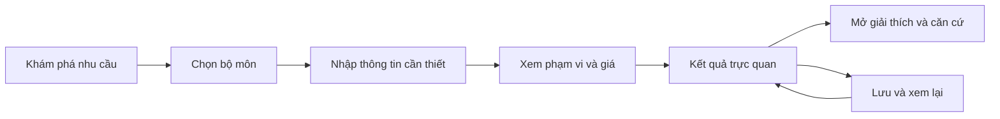

# Nghiên cứu và đề xuất nâng cấp toàn diện AstroX

> Cập nhật phạm vi triển khai: người dùng chốt “Giữ giao diện hiện tại, thêm tính năng mới”. Các ý tưởng thay giao diện dưới đây là nghiên cứu, không phải thiết kế được triển khai. Tarot giữ nguyên DeckPicker và bàn trải; chỉ thêm Tự động, hiệu ứng sáng và các sửa lỗi tương tác/reflow. Xem kế hoạch và biên bản QA ngày 2026-10-08.

Ngày khảo sát: 08/10/2026, giờ Việt Nam. Trạng thái: đề xuất sản phẩm để xem xét, chưa phải thiết kế đã duyệt hoặc kế hoạch triển khai đã chốt.

AstroX nên phát triển thành một trải nghiệm hiểu bản thân có chiều sâu, trong đó người dùng nhanh chóng tìm đúng dịch vụ, hiểu ý chính bằng hình ảnh và chủ động mở phần giải thích. Giữ nhận diện kem–xanh, những bộ tính và quyền lợi đã mua; thiết kế lại cách tổ chức thông tin, các hành trình và bộ thành phần dùng chung.

## 1. Phạm vi và độ chắc chắn của khảo sát

Đã xem các lối vào công khai của 10 module tiếng Việt, trang chủ, hồ sơ, form thông tin sinh, menu khám phá và bảng giá trên production. Đã quan sát các màn đại diện ở viewport 390×844, 768×1024 và 1440×1000. Đây là khảo sát giao diện trình duyệt, không phải chứng nhận tương thích toàn bộ thiết bị.

Đã đối chiếu kiến trúc module, điều hướng, luận giải, hồ sơ, ví, thị trường VN/US và Admin trong mã nguồn. Checkout ban đầu ở `2fd3c1b` cũ hơn production; các kết luận về nền tảng hiện tại đã được cập nhật theo `origin/main` vừa fetch, SHA `2c02291c6159b63f0fe20793239ba7db73d07a59`.

Chưa thực hiện giao dịch, đặt lịch, gọi AI trả phí, thay đổi cấu hình hoặc đăng nhập Admin. Chưa đo Core Web Vitals thực địa, tỷ lệ chuyển đổi, hành vi người dùng hay chất lượng một tập bài luận giải production. Các đề xuất ưu tiên là đánh giá chuyên môn; hiệu quả tăng trưởng cần được kiểm chứng.

Owner: Codex `/root`. Nhánh: `codex/product-upgrade-research`. Worktree: `/Users/Thsonjpg/.codex/worktrees/product-upgrade-research/astrox`. Base commit: `2c02291c6159b63f0fe20793239ba7db73d07a59`. Phạm vi ghi: tài liệu này và `docs/design/2026-10-08-tarot-auto-spread-research.md`. Không sửa mã sản phẩm, dữ liệu hoặc cấu hình production.

Cập nhật yêu cầu ngày 08/10: người dùng xác nhận thiết kế riêng cho điện thoại, tablet, desktop và kiểm tra bàn phím, zoom, tooltip, dock, lỗi là **bắt buộc**. Với Tarot, chế độ mặc định phải quyết định theo nội dung, độ phức tạp và ngữ cảnh câu hỏi; yêu cầu này thay thế ý tưởng random kiểu trải ban đầu. Hiệu ứng sáng chạy lần lượt chỉ trình bày quyết định. JEV trên B.AI là ứng viên ưu tiên để kiểm chứng theo gợi ý của người dùng; cần adapter Decisions riêng và đánh giá tiếng Việt trước khi chọn production. Chi tiết trong [nghiên cứu Tarot](</Users/Thsonjpg/.codex/worktrees/product-upgrade-research/astrox/docs/design/2026-10-08-tarot-auto-spread-research.md>).

## 2. Những nền tảng nên kế thừa

| Nền tảng đang có | Hướng phát triển tiếp |
|---|---|
| Nhận diện kem, xanh trầm, chữ tiêu đề có cá tính và Be Vietnam Pro | Chuẩn hóa độ tương phản, cấp chữ, khoảng cách và mức độ trang trí |
| Desktop đã nhóm “Tìm hiểu bản thân”, “Hỏi đáp” | Đồng nhất cách nhóm trên mobile và trang khám phá |
| Báo cáo trực quan cho Tử Vi, Cung Hoàng Đạo, Bát Tự, Thần Số Học, Tương Hợp | Làm hình học và tương tác diễn đạt đúng dữ liệu từng bộ môn |
| Bài đọc có tóm tắt, chương, phần mở rộng, căn cứ và hành động | Bớt lặp tiêu đề, rút ngắn lớp hiển thị đầu tiên, giữ độ sâu phía sau |
| Nghe, sao chép, chia sẻ; giải nghĩa thuật ngữ; giảm chuyển động | Tăng độ dễ tìm và kiểm tra với giọng đọc, bàn phím, thiết bị thật |
| Giá do server xác định; mở khóa theo hồ sơ/kỳ/lượt; khấu trừ khi nâng cấp | Giải thích phạm vi mua ngay tại quyết định, trình bày rõ phần đã sở hữu |
| Có lưu phiên bản và nâng cấp bài cũ sang dạng trực quan | Duy trì quyền truy cập, dấu thời gian và nội dung đã mua khi đổi giao diện |
| Có tách thị trường VN/US, dữ liệu thời gian quốc tế và điều hướng theo locale | Làm rõ khác biệt giữa ngôn ngữ, khu vực, phương thức đăng nhập và ví |
| Main mới nhất có xử lý fallback cho phản hồi AI sai hoặc bị cắt | Theo dõi tỷ lệ thành công đầu cuối và chất lượng; kiểm chứng từng route khi phát hành |

Việc tạo biểu đồ, toolbar hoặc fallback từ đầu không phải khoảng trống chính. Khoảng trống là tính nhất quán và chất lượng trải nghiệm xuyên suốt các nền tảng đã có.

## 3. Các phát hiện ưu tiên

| Mã | Bằng chứng hiện tại | Tác động có thể có | Đề xuất |
|---|---|---|---|
| F01 | Khách thấy hộp chọn khu vực/đăng nhập trước nội dung; form sinh có nhiều trường | Phải quyết định trước khi hiểu giá trị | Cho khám phá trước; hỏi dữ liệu đúng lúc, chỉ lấy trường module cần |
| F02 | Trang chủ khách dành vị trí nổi bật cho lịch âm, điểm danh và hoàn tất hồ sơ | Giá trị luận giải chưa được giới thiệu rõ ở lần đầu | Trang chủ khác nhau theo khách mới/người quay lại; đưa tác vụ và kết quả mẫu lên trước |
| F03 | Tử Vi, Bát Tự, Hoàng Đạo, Thần Số Học có màn thiếu hồ sơ thiên về lời dẫn và CTA | Chưa thấy cụ thể sẽ nhận được gì | Một hình minh họa kết quả có nhãn “Mẫu”, dữ liệu cần nhập và một CTA |
| F04 | Ở Tarot mobile, khu vực bộ bài chiếm phần lớn màn đầu; câu hỏi và kiểu trải ở dưới | Trang trí đứng trước quyết định bắt đầu | Rút gọn bộ bài thành lựa chọn phụ; giữ nghi thức lớn ở bước rút bài |
| F05 | Bảng giá công khai mở nhiều nhóm và mục con cùng lúc, lặp mô tả phạm vi | Khó so sánh và tìm mức giá cần dùng | Tìm theo dịch vụ, thu gọn nhóm, so sánh “từng phần/cả nhóm/cả module” theo ngữ cảnh |
| F06 | `VisualReading` xếp nhiều loại hình theo các node đánh số trên vòng tròn; có các lớp tóm tắt/tiêu đề liên tiếp | Người dùng phải đối chiếu số và nhãn; hình có thể mang tính trang trí nhiều hơn giải thích | Nhãn trực tiếp trên hình, hình học riêng cho từng module, tóm tắt một lần |
| F07 | Desktop có nhóm nhu cầu; dock mobile ưu tiên Tử Vi/Tarot và một menu chứa nhiều mục | Cách tìm tính năng thay đổi giữa thiết bị | Một kiến trúc thông tin chung; bố cục riêng theo thiết bị |
| F08 | Chỉ tay công khai đang khóa “Đang phát triển”; chuyên gia hiện “Chưa có lịch tư vấn” | Có lối vào dẫn tới trạng thái chưa dùng được | Trạng thái nhất quán từ menu đến trang; empty state có bước tiếp theo phù hợp |
| F09 | Các lịch sử và bài đã lưu có cơ chế riêng theo module | Việc tìm lại xuyên module có thể tốn công | Một thư viện thống nhất, vẫn giữ bộ lọc và ngữ cảnh từng module |
| F10 | Mã nguồn hiện tách tài khoản theo thị trường; đổi ngôn ngữ khi đăng nhập liên quan đến đăng xuất | Biểu tượng ngôn ngữ dễ tạo kỳ vọng chỉ dịch chữ | Hiển thị rõ “Ngôn ngữ & khu vực”; bảo toàn bản nháp, giải thích hệ quả trước khi chuyển |

F01–F05, F07–F08 dựa trên giao diện công khai đã quan sát. F06, F09–F10 chủ yếu dựa trên mã nguồn hiện tại; cần kiểm thử người dùng và phiên đăng nhập thật trước khi định lượng mức ảnh hưởng. Các phát hiện này không khẳng định đã có lỗi thu phí, mất dữ liệu hoặc giảm chuyển đổi.

## 4. Lựa chọn hướng nâng cấp

| Hướng | Phạm vi | Đánh đổi |
|---|---|---|
| Tinh chỉnh giao diện hiện tại | Sửa chữ, spacing, màu, kích thước và hiệu ứng từng trang | Dễ phát hành, nhưng không xử lý sự phân tán giữa các hành trình |
| Thiết kế lại hệ thống trải nghiệm — đề xuất chọn | Chuẩn hóa điều hướng, nhập liệu, reader, thư viện, giá và trạng thái; chuyển từng module | Thay đổi đủ sâu và có thể kiểm soát hồi quy, nhưng cần giữ hợp đồng dữ liệu giữa các đợt |
| Viết lại toàn bộ | Thay nền tảng và dựng lại tính năng | Rủi ro lớn với bộ tính, bài đã mua, thanh toán, bản địa hóa; chưa có bằng chứng cần làm |

“Triệt để” nên thể hiện ở việc giải quyết cùng một vấn đề trên toàn sản phẩm và đủ mọi trạng thái. Không cần thay framework hoặc viết lại các bộ tính đang đáp ứng yêu cầu.

Giả định định hướng: ưu tiên trải nghiệm tiếng Việt trên mobile, đồng thời yêu cầu tính nhất quán và kiểm tra hồi quy cho tiếng Anh. Không tự thay đổi phạm vi thương mại VN/US.

## 5. Kiến trúc sản phẩm đề xuất

Điều hướng chính hướng tới bốn đích rõ ràng: **Hôm nay · Khám phá · Đã lưu · Cá nhân**. Mobile có thể dùng bốn tab; desktop dùng cùng tên và cấu trúc, mở thêm không gian cho tìm kiếm. Đây là phương án cần kiểm thử với người thường dùng Tử Vi/Tarot trước khi thay dock hiện tại; “Gần đây” giúp giữ lối tắt cho nhóm này.

Trong Khám phá, người dùng có hai cách chọn: theo nhu cầu và theo bộ môn. Các nhu cầu gợi ý: Hiểu mình, Mối quan hệ, Một câu hỏi, Nhịp thời gian. Tên bộ môn luôn còn rõ ràng, tránh giấu dưới nhãn tiếp thị. Danh sách bộ môn dùng lưới ô vuông nhất quán với hợp đồng giao diện hiện tại.

Luồng miễn phí bỏ bước xác nhận thanh toán. Nội dung đã sở hữu mở lại trực tiếp. Dữ liệu đã có được điền sẵn và có lối sửa; không bắt người dùng nhập cùng dữ liệu qua từng module.

Trang Hôm nay có hai cấu trúc:

- Khách mới: một câu giới thiệu giá trị, ba lựa chọn nhu cầu, một mẫu kết quả và lối khám phá bộ môn. Đăng nhập xuất hiện khi cần lưu đồng bộ hoặc dùng tính năng yêu cầu tài khoản.
- Người quay lại: đọc tiếp, nội dung cá nhân đúng kỳ, các dịch vụ gần đây. Lịch âm và điểm danh là tiện ích gọn, không lấn phần đọc chính.

## 6. Đề xuất cho toàn bộ nhóm tính năng

P0 là nền tảng phải bảo đảm trước khi mở rộng; P1 là lõi của đợt thiết kế lại; P2 hoàn thiện sau khi lõi đã kiểm chứng. Đây là thứ tự sản phẩm, không phải phân loại lỗi bảo mật.

| Tính năng | Nâng cấp cụ thể | Tiêu chí nghiệm thu chính | Ưu tiên |
|---|---|---|---|
| Trang chủ | Phân biệt khách mới/người quay lại; một tác vụ chính; đọc tiếp và lối tắt có ngữ cảnh; lịch/điểm danh gọn | Người mới tìm được một dịch vụ phù hợp mà không cần hiểu toàn bộ thuật ngữ | P1 |
| Khám phá và tìm kiếm | Nhóm theo nhu cầu và bộ môn; tìm không dấu; trạng thái miễn phí/đã mở/đang phát triển thống nhất | Không có lối vào mâu thuẫn với trạng thái dịch vụ; deep link giữ đúng chủ đề | P1 |
| Hồ sơ và nhập liệu | Thu thập theo nhu cầu; giải thích ngay cạnh trường khó; phân biệt tên gọi/họ tên tính toán; lưu nháp; dùng lại dữ liệu | Module không cần giờ sinh không bị chặn vì thiếu giờ; dữ liệu thiếu không bị tự bịa | P0/P1 |
| Tử Vi | Mở bằng ý chính; lá số 12 cung có chọn cung và phóng to; liên kết nhận định với sao/cung; nhóm luận giải theo nhu cầu; vận trình tách hôm nay/tuần/tháng | Cùng dữ liệu sinh vẫn cho cùng lá số; chọn cung làm nổi đúng dữ kiện; kỳ và quyền đã mua chính xác | P1 |
| Cung Hoàng Đạo | Bộ ba cốt lõi dễ đọc; bản đồ sao có lớp thông tin; nhà/hành tinh/góc chiếu hiện theo lựa chọn; nêu phần phụ thuộc giờ sinh | Thiếu giờ chính xác không trình bày Cung Mọc/nhà như dữ kiện chắc chắn; giữ xử lý múi giờ/DST | P1 |
| Bát Tự | Tứ trụ trên một hàng có thể khám phá; ngũ hành với cách tính rõ; đại vận theo trục thời gian; thuật ngữ ở nơi cần đọc | Phân biệt số lượng ngũ hành với kết luận mạnh/yếu; đơn vị, kỳ và dữ liệu gốc có thể truy vết | P1 |
| Thần Số Học | Ưu tiên chỉ số cốt lõi; ma trận ngày sinh và cách chuyển tên; chu kỳ thành timeline; giải thích cách tính ngay khi chạm | Tên đang được dùng rõ ràng; tên gọi và họ tên khai sinh không bị đánh đồng âm thầm; kết quả lặp lại được | P1 |
| Tarot | Mặc định tự chọn kiểu trải và góc nhìn theo câu hỏi, độ phức tạp, ngữ cảnh; chọn tay có ưu tiên; hiệu ứng sáng chạy lần lượt rồi dừng ở quyết định; bộ bài thu gọn; kết quả nối từng vị trí với một ý chính | Không dùng random để thay quyết định theo ngữ nghĩa; lỗi phân loại có fallback minh bạch; bỏ qua animation không đổi bài; giá/nhật ký khớp kiểu trải; bàn phím và bố cục riêng ba nhóm thiết bị | P1 |
| Kinh Dịch | Một cách lập quẻ mặc định dễ hiểu; cách khác ở mục tùy chọn; hiển thị quẻ chủ → hào động → quẻ biến; câu hỏi và lịch sử có ngữ cảnh | Kết quả chỉ rõ cách lập quẻ; lời giải gắn đúng hào; dữ liệu quẻ cũ được giữ | P1 |
| Tương Hợp | Chọn hai hồ sơ, tóm tắt điểm đồng điệu/khác biệt/cách trao đổi; chuyển bộ môn trong cùng ngữ cảnh | Không biến mức tương hợp thành xác suất quan hệ thành công; mọi nhận định chỉ rõ bộ môn và hai hồ sơ | P1 |
| Chỉ tay | Giữ khóa cho đến khi đạt gate; khi mở lại: chụp → kiểm tra ảnh → đồng ý xử lý → kết quả; hướng dẫn tại chỗ, lịch sử và xóa ảnh rõ | Kiểm tra camera thật, ảnh tối/mờ, từ chối quyền và mất mạng; không vẽ đường phát hiện nếu chưa có bằng chứng định vị | P2 |
| Lịch âm | Tháng/ngày có thứ bậc; lọc ngày theo mục đích; đổi âm/dương ít bước; sự kiện gia đình và xuất lịch; nhãn UTC+7 nhất quán | Ngày nhuận, biên ngày, biên năm đúng; mô tả rõ dữ liệu nào lưu trên thiết bị; đồng bộ là nâng cấp riêng cần thiết kế | P1/P2 |
| Chuyên gia | Hồ sơ chuyên môn, lịch rảnh, thời lượng và phí trước đặt; xác nhận/hủy/đổi lịch rõ; empty state có hỗ trợ hoặc ngày quay lại khi có dữ liệu | Không hứa xác nhận tức thì khi vẫn duyệt thủ công; không quảng bá lịch trống khi không có; chống đặt trùng được giữ | P2 |
| Reader dùng chung | Ý chính → hình → một hành động → giải thích/căn cứ; giảm phần lặp; các module vẫn có hình riêng; giữ nghe/copy/share | Chọn hình tới đúng ý; người dùng tìm căn cứ mà không phải đọc hết báo cáo; bài cũ vẫn đọc được | P1 |
| Thư viện đã lưu | Gộp bài đọc các module, tìm kiếm, bộ lọc, dấu thời gian, hồ sơ, đọc tiếp; phân biệt nội dung đã mua và quyền tạo bài mới | Không thu phí lại vì đổi giao diện; không lẫn bài giữa tài khoản, hồ sơ, thị trường hoặc kỳ | P1 |
| Giá và mở khóa | Bảng giá thu gọn theo module; phạm vi mua, khấu trừ, số dư và chi phí cuối ở một nơi; dẫn tới đúng phần đã sở hữu | UI, báo giá server và giao dịch khớp; không âm thầm đổi quy tắc khấu trừ đang áp dụng | P0/P1 |
| Ví và nạp | Đơn vị Point/Credits theo thị trường; giá tiền thật và tổng nhận rõ; trạng thái chờ/đã nạp/hủy/hết hạn/hoàn; giữ đường quay lại dịch vụ | Trở về từ cổng thanh toán chưa được coi là trả tiền thành công; xác nhận phải từ trạng thái server | P0/P1 |
| Điểm danh, giới thiệu, quảng cáo | Gộp vào “Kiếm thêm”; một trạng thái và một CTA cho từng cách; quyền lợi, điều kiện và giới hạn ngắn gọn | Phần thưởng đúng cấu hình đã xuất bản; không đánh dấu đã nhận khi mới hoàn tất animation | P2 |
| Tài khoản và cài đặt | Chỉnh dữ liệu, đồng bộ, cỡ chữ, chuyển động, khu vực rõ ràng; quản lý riêng dữ liệu chia sẻ | Chuyển tài khoản không lẫn hồ sơ; lỗi đồng bộ không bị thể hiện như đã lưu thành công | P0/P1 |
| Tiếng Anh và US | Hoàn thiện tên gọi tự nhiên, ngày/tiền, dữ liệu sinh, điều hướng và trạng thái dịch vụ khả dụng; tách ngôn ngữ khỏi kỳ vọng đổi ví | Không trộn Point/Credits hoặc quyền đã mua; kiểm tra route parity theo thị trường, không giả định hai thị trường có cùng tính năng | P0/P1 |
| Hỗ trợ và điều khoản | Hỗ trợ đúng ngữ cảnh bài/đơn; mã tham chiếu dễ copy; thông tin phạm vi dịch vụ và quyền riêng tư ngắn ở đúng bước | Người dùng tìm được giao dịch/bài đang có vấn đề; không đòi gửi toàn bộ dữ liệu cá nhân để chẩn đoán | P1 |
| Admin | Chia theo công việc vận hành; việc cần xử lý lên trước; xem trước public, diff và ảnh hưởng trước publish; lưu/publish/rollback phân biệt rõ | Draft, published và hành vi public có thể đối chiếu; hành động quan trọng có quyền hạn và audit | P0/P1 |

## 7. Luận giải trực quan cần diễn đạt điều gì

Mã hiện tại đã có schema và bộ kiểm tra dữ kiện. Nâng cấp nên mở rộng các kiểu trình bày dựa trên nền tảng này. Không dùng một vòng tròn hoặc radar cho tất cả chủ đề.

| Module | Hình nên dùng | Tương tác chính | Điều cần tránh |
|---|---|---|---|
| Tử Vi | Bản đồ 12 cung, liên kết sao/cung, timeline vận trình | Chạm cung hoặc mốc để thấy nhận định và dữ kiện liên quan | Hình tròn đánh số không phản ánh vị trí cung nhưng trông như lá số |
| Hoàng Đạo | Vòng hoàng đạo, vị trí hành tinh, lớp góc chiếu | Chọn một hành tinh hoặc nhóm quan hệ | Hiện mọi nhãn/góc chiếu cùng lúc trên mobile |
| Bát Tự | Bốn trụ, thanh số lượng ngũ hành, sơ đồ sinh/khắc | Đổi giữa dữ kiện và diễn giải cân bằng | Gọi tỷ lệ đếm là độ mạnh hoặc vận may nếu chưa có phương pháp |
| Thần Số Học | Ma trận 3×3, chuỗi chuyển tên thành số, timeline chu kỳ | Chạm số để xem cách tính và ý nghĩa | Gán phần trăm chính xác tính cách |
| Tarot | Trải bài giữ đúng vị trí, đường đọc giữa các lá | Chọn lá xem vai trò, nghĩa và liên hệ câu hỏi | Để bài dài tách rời hoàn toàn các lá được rút |
| Kinh Dịch | Quẻ chủ/hào động/quẻ biến đặt cạnh nhau | Chạm hào để xem thay đổi | Minh họa không chỉ ra hào nào thay đổi |
| Tương Hợp | Hai hồ sơ và các mặt đối chiếu; nhóm đồng điệu/khác biệt | Chọn chủ đề giao tiếp, nhịp sống, nhu cầu | Một con số “độ hợp” thay thế toàn bộ giải thích |
| Chỉ tay | Ảnh thật cùng chú giải quan sát đã được xác minh | Chọn đường đọc và vùng tương ứng nếu bộ nhận diện hỗ trợ | Overlay giả, đường vẽ chính xác nhưng model chỉ trả lời bằng văn bản |
| Lịch/vận trình | Timeline có ngày, kỳ, múi giờ và loại dữ liệu rõ | Chọn ngày/kỳ, đọc tóm tắt | Trộn hướng dẫn lịch dân gian chung với dự báo cá nhân |

Reader đề xuất có ba độ sâu. Mức đầu: tiêu đề trực tiếp, một kết luận, hình chính và hành động. Mức tiếp: vài nhận định có thể chọn. Mức sâu: lý giải, dữ kiện, ví dụ và thuật ngữ. Mở rộng từng phần tại chỗ, không bắt người dùng đi qua nhiều màn.

Hợp đồng hiện tại hướng tới 900–1500 từ và kiểm tra tối thiểu 600 từ. “Ít text thừa” trước hết cần giảm chữ lặp ở lớp giao diện, không cắt cụt độ sâu của nội dung đã mua. Nếu thay độ dài đầu ra, phải phiên bản hóa hợp đồng, thử chất lượng và giữ renderer cho bài cũ.

## 8. Hệ thống UI và nội dung

Giữ nền kem, xanh rừng làm màu hành động, vàng chỉ làm điểm nhấn. Dùng một màu ngữ nghĩa nhất quán cho thành công/cảnh báo/lỗi; màu module chỉ xuất hiện khi giúp nhận diện. Mặt đọc bài ưu tiên nền phẳng để dễ đọc, glass giới hạn ở shell hoặc lớp nổi.

Giữ Be Vietnam Pro cho nội dung và font display hiện có ở một số tiêu đề. Dùng ít cấp chữ: tiêu đề trang, tiêu đề phần, thân bài, chú thích. Mốc đề xuất để thử: thân bài 16–18px, nhãn 14px; không thu nhỏ chữ chỉ để nhét thêm nội dung. Khoảng cách theo nhịp 4/8px; cột đọc khoảng 60–70 ký tự; thiết kế token ngữ nghĩa cho chữ, nền, viền, focus và khoảng cách.

Một màn chỉ có một hành động nổi bật tại mỗi thời điểm. Những việc ngang hàng dùng cùng kiểu nút. Hạn chế chuỗi eyebrow → tiêu đề → tiêu đề lặp → mô tả chung trước nội dung. Họa tiết chỉ nằm ở nơi tạo bản sắc, không bao quanh mọi đoạn.

| Copy hiện thấy | Cách rút gọn đề xuất | Ý nghĩa cần giữ |
|---|---|---|
| “Hồ sơ của bạn chưa đủ thông tin sinh. Bổ sung một lần để AstroX tự lập lá số và sử dụng cho những lần sau.” | “Thêm ngày và giờ sinh để lập lá số.” | Cơ chế lưu và dùng lại chuyển xuống form |
| “Điều bạn đang nghĩ tới” cùng nhiều lời dẫn trải bài | “Bạn muốn hỏi điều gì?” | Giữ nhãn tùy chọn khi câu hỏi không bắt buộc |
| “Hiểu sâu hơn & xem căn cứ” | “Vì sao?” hoặc “Xem giải thích” tùy loại nội dung | Không giấu cả nội dung chính lẫn căn cứ sau một nhãn mơ hồ |
| Cùng mô tả “theo hồ sơ/kỳ” lặp ở mọi hàng | Mô tả một lần ở nhóm, ngoại lệ ghi tại hàng | Phạm vi mua vẫn rõ trước xác nhận |
| “Chưa có lịch tư vấn” | “Chưa có giờ trống” + lối hỗ trợ | Chỉ nêu ngày mở lịch khi có dữ liệu thật |

Đây là nguyên tắc hiện thông tin theo nhu cầu: tác vụ chính dễ thấy, phần phức tạp có thể mở khi cần. Cơ sở tham khảo: [NN/g về progressive disclosure](https://www.nngroup.com/articles/progressive-disclosure/).

Chuyển động ngắn, có mục đích: phản hồi khi nhấn, chuyển lựa chọn, nối trạng thái chờ với kết quả. Thời lượng đề xuất để thử 150–250ms cho điều khiển, tối đa khoảng 350ms cho chuyển panel. Nghi thức Tarot có thể dài hơn nhưng cần bỏ qua/giảm chuyển động. Không chặn nội dung để chờ animation và không dùng tiến độ phần trăm giả khi chưa đo được.

## 9. Thiết kế riêng theo thiết bị — yêu cầu bắt buộc

Đây là cổng nghiệm thu xuyên suốt toàn bộ sản phẩm, không phải phần trang trí tùy chọn hoặc đợt sửa responsive cuối cùng. Mỗi hành trình được bàn giao phải có bố cục điện thoại, tablet và desktop riêng, dùng chung nội dung và trạng thái nghiệp vụ. Chọn bố cục theo không gian khả dụng và khả năng nhập liệu, không chỉ nhận diện tên thiết bị. Tablet ngang vẫn phải dùng được bằng cảm ứng; desktop zoom lớn có thể chuyển sang bố cục gọn.

| Dải kiểm tra | Cách tổ chức bắt buộc phải thiết kế | Rủi ro cần kiểm chứng |
|---|---|---|
| 320–359px | Một cột, nhãn ngắn nhưng đủ nghĩa, CTA trong dòng đọc | Form dài, giá, header và hộp thoại chật |
| 360–430px | Một cột; hình tương tác với phần giải thích bên dưới; tab đáy gọn | Bàn phím, safe area, nút bị dock che, thao tác bằng một tay |
| 600–834px | Dùng hai cột khi có quan hệ hình–giải thích; giới hạn độ rộng chữ | Tránh phóng to máy móc giao diện điện thoại và tạo khoảng trống vô ích |
| 1024px | Kiểm tra riêng ngưỡng đổi shell; đủ chỗ cho menu và tài khoản | Nhãn dài tiếng Anh, dropdown, touch trên tablet ngang |
| 1280–1600px | Mục lục/hình phụ bên cạnh cột đọc | Dòng chữ quá dài, nhiều vùng cùng tranh chú ý |
| 1920–2560px | Giới hạn chiều rộng nội dung; giữ tỷ lệ chữ hợp lý | Kéo giãn card hoặc biểu đồ chỉ để lấp màn hình |

Đích nghiệm thu: nội dung thông thường reflow ở 320 CSS px; sơ đồ hai chiều phức tạp có vùng phóng to/cuộn riêng và phương án đọc bằng danh sách. WCAG cho phép ngoại lệ với nội dung cần bố cục hai chiều, không phải toàn trang. [W3C Reflow](https://www.w3.org/WAI/WCAG22/Understanding/reflow.html).

Chọn vùng chạm 44–48 CSS px làm mục tiêu thiết kế cho điều khiển quan trọng. Phân biệt với WCAG 2.2 AA: tiêu chí kích thước tối thiểu là 24×24 CSS px với các ngoại lệ về khoảng cách, nội tuyến và tương đương. [W3C Target Size](https://www.w3.org/WAI/WCAG22/Understanding/target-size-minimum.html).

Kiểm tra thêm: zoom 200% và reflow tương đương 400%; tương phản chữ thường 4.5:1; bàn phím và focus; đọc màn hình; reduced motion; xoay ngang; bàn phím mở; nhập liệu lỗi; chuỗi tên dài; bài cực dài; tooltip ở bốn mép màn hình. Hình không chỉ mã hóa bằng màu. Thao tác kéo/vuốt có nút thay thế.

Giữ ma trận 30 viewport của dự án và cập nhật các kỳ vọng đã lỗi thời với trang chủ mới. Bổ sung Safari iPhone, Chrome Android, Safari iPad, Chrome/Edge desktop và ít nhất một thiết bị cấu hình thấp. Không dùng `overflow-x: hidden` hoặc kết quả “không tràn trang” làm bằng chứng duy nhất rằng mọi nội dung đều dùng được.

| Nhóm kiểm tra bắt buộc | Điều kiện nghiệm thu |
|---|---|
| Bố cục | Điện thoại ưu tiên một tác vụ và thao tác chạm; tablet có bố cục hình–chi tiết khi đủ chỗ; desktop dùng cột phụ/mục lục với độ rộng đọc giới hạn. Không chỉ thu nhỏ cùng một canvas |
| Bàn phím vật lý | Hoàn tất tác vụ chính bằng Tab, Shift+Tab, Enter/Space và phím điều hướng phù hợp; focus thấy rõ, đúng thứ tự; modal giữ và trả focus; không bẫy bàn phím |
| Bàn phím ảo | Ô đang nhập, lỗi và nút tiếp tục nhìn thấy được; dock không chồng bàn phím; mở/đóng bàn phím, xoay máy và đổi kích thước không mất bản nháp |
| Zoom | Chữ và điều khiển dùng được ở 200%; nội dung thường reflow ở 320 CSS px/tương đương 400% trên viewport rộng 1280px. Sơ đồ có vùng riêng và danh sách tương đương |
| Tooltip/chú giải | Mở bằng focus hoặc chạm, không phụ thuộc hover; không bị cắt ở bốn mép; đóng bằng Escape/chạm ngoài; thông tin cốt lõi không chỉ nằm trong tooltip |
| Dock và lớp nổi | Safe area, footer, CTA, toast, tooltip, modal không che nhau; phần tử đang focus không bị lớp sticky che; khi bàn phím mở, CTA về dòng form và dock tạm ẩn |
| Trạng thái lỗi | Thiếu/sai đầu vào, offline, timeout, lỗi ảnh, hết phiên, thiếu số dư và dịch vụ tạm khóa có thông báo đúng chỗ và bước phục hồi; giữ dữ liệu và bài đang xem |
| Dữ liệu/khả năng tiếp cận | VI/EN theo phạm vi thị trường, tên dài, bài dài, đọc màn hình, reduced motion, dọc/ngang và cảm ứng có kết quả kiểm tra |

Báo cáo nghiệm thu phải ghi route × trạng thái × viewport, pass/fail/blocked thực tế, ảnh hoặc video đại diện, lỗi còn lại, browser/OS, thiết bị thật so với giả lập, layout shift và giới hạn đo. Thiếu bằng chứng của một nhóm bắt buộc thì nhóm đó chưa đạt; không suy rộng từ một trang mẫu sang toàn bộ sản phẩm. Public và Admin đều nằm trong phạm vi, kiểm tra theo quyền và tính năng thực sự khả dụng.

## 10. Admin và nền tảng vận hành

Admin nên tổ chức theo sáu nhóm việc: Theo dõi; Người dùng & hỗ trợ; Dịch vụ & nội dung; AI & chất lượng; Thanh toán & tăng trưởng; Hệ thống & quyền truy cập. Giữ tìm kiếm điều hướng hiện có, bổ sung lối truy từ sự cố đến màn có thể xử lý.

| Công việc | Nâng cấp nên làm |
|---|---|
| Dịch vụ/giá | Hiện cây dịch vụ với trạng thái kế thừa và override; tìm kiếm; xem trước giá public; cảnh báo chênh phạm vi gói |
| Prompt/nội dung | So sánh phiên bản; bộ ví dụ kiểm tra theo module và VI/EN; preview đúng reader; giữ bản gốc và lịch sử |
| AI/provider | Hiện route thực tế sau kế thừa; thời gian tới nội dung đầu tiên, tổng thời gian, lỗi schema, cắt cụt, fallback và chi phí theo dịch vụ |
| Billing/ví | Theo dõi vòng đời đơn và ledger; lọc đơn treo/hoàn; link từ ticket tới giao dịch; tránh điều chỉnh số dư không có audit |
| Chuyên gia | Lịch theo tuần, xung đột, thời gian nghỉ, việc chờ xác nhận; hiển thị người chịu trách nhiệm và mốc xử lý |
| Publish | Phân biệt rõ bản nháp và bản đang chạy; diff tác động; preview hai thị trường; kiểm tra public sau xuất bản; rollback thành phiên bản có dấu vết |

Tận dụng module registry, service tree, server quote, report schema và cơ chế operation ID hiện có. Chuẩn hóa những phần giao diện lặp lại thành các thành phần có trách nhiệm rõ: shell, chọn dịch vụ, nhập hồ sơ, reader, thư viện, xác nhận giá và trạng thái kết quả.

AI cần trả nội dung theo hợp đồng, bộ tính cung cấp dữ kiện, renderer dựng hình theo recipe được kiểm soát. Không để AI tự quyết định giá, tọa độ sơ đồ hoặc phần trăm. Cùng một lượt phải có ngữ cảnh đủ để khôi phục khi mất mạng/chuyển tab; trạng thái thu phí phải xác minh với server.

Định nghĩa nhất quán cho loading, partial, complete, failed, retry, cancelled, refunded và unavailable. Chỉ dùng các trạng thái backend thực sự hỗ trợ; không vẽ thêm trạng thái thành công ở frontend. Nội dung hiện được từng phần chỉ khi backend/schema cho phép xác minh từng phần, tránh hiện JSON chưa hoàn chỉnh như bài đọc.

Tải theo nhu cầu đối với bộ tính nặng, MediaPipe, camera, hình và video. Cache theo tài khoản, hồ sơ, locale, phạm vi dịch vụ, kỳ và phiên bản hợp đồng; bảo toàn bài đã mua. Đo hiệu năng trước khi chọn tối ưu cụ thể.

## 11. Lộ trình triển khai theo cổng nghiệm thu

| Đợt | Bàn giao | Điều kiện để đi tiếp |
|---|---|---|
| 0 — Chốt baseline | Ma trận route/state/market, kiểm kê component, số đo funnel và hiệu năng, danh sách quyền đã mua cần bảo toàn | Xác định rõ production revision và dữ liệu thử; thống nhất hướng thiết kế |
| 1 — Shell và hành trình vào | Trang chủ hai trạng thái, khám phá, hồ sơ theo nhu cầu, token và quy tắc copy | Prototype kiểm thử trên mobile/tablet/desktop; người dùng tìm dịch vụ và hoàn tất đầu vào |
| 2 — Reader và thư viện | Reader nâng cấp; Tử Vi + Tarot làm hai mẫu đại diện; thư viện/đọc tiếp; bài cũ và quyền truy cập | Tử Vi kiểm chứng dữ liệu dạng cấu trúc; Tarot kiểm chứng nghi thức và dữ liệu phiên; không mất bài hoặc thu phí lại |
| 3 — Hoàn thiện module | Hoàng Đạo, Bát Tự, Thần Số Học, Kinh Dịch, Tương Hợp, lịch âm | Mỗi module có hình riêng, đầy đủ empty/error/loading/saved và kiểm tra VI/EN |
| 4 — Thương mại và vận hành | Giá, ví, rewards, Admin, chuyên gia; chỉ tay khi đạt điều kiện | Đối chiếu giá/ledger, trạng thái publish, lịch hẹn; kiểm tra thiết bị thật và provider |
| 5 — Phát hành theo phần | Bật từng nhóm bằng cơ chế rollout hiện có hoặc flag được thiết kế, theo dõi và rollback | Chỉ phát hành từ SHA đã kiểm chứng; kiểm tra route/API production và hành vi tài khoản sau deploy |

Các kiểm tra P0 về quyền, thanh toán, dữ liệu và thị trường cùng cổng nghiệm thu đa thiết bị tại mục 9 đi cùng mọi đợt, không chờ đến đợt 4. Không cam kết thời gian trước khi chốt phạm vi và nhân lực. Một bản phát hành phải hoàn tất cả trạng thái lỗi và khôi phục, không chỉ màn thành công. Tarot ở đợt 2 phải kiểm chứng cả quyết định kiểu trải theo câu hỏi và nghi thức mới theo tài liệu nghiên cứu liên kết ở mục 1.

Owner tích hợp chịu trách nhiệm shared registry, pricing, dispatcher và navigation. Mỗi đợt làm trong worktree riêng, tích hợp tuần tự. Khi có thay đổi dữ liệu: migration trước, Worker rồi Pages từ cùng SHA; ghi deployment ID, public checks và rollback. Không đổi contract hoặc giá chỉ để UI dễ triển khai.

## 12. Cách đánh giá hiệu quả

| Mục tiêu | Cách đo và điều kiện |
|---|---|
| Dễ bắt đầu | Thời gian từ vào trang đến tìm đúng module và hoàn thành đầu vào; tách khách mới/người quay lại và từng thị trường |
| Hiểu kết quả | Yêu cầu người thử nói lại ý chính và tìm dữ kiện hỗ trợ; ghi nơi bị nhầm, không chỉ hỏi “đẹp không” |
| Ít chữ thừa | Kiểm kê câu lặp, số lớp nhãn trước nội dung; thử bản ngắn hơn và giữ tỷ lệ hiểu đúng |
| Xem lại dễ | Thời gian tìm lại một bài đã đọc; tỷ lệ mở nhầm hồ sơ/kỳ; kiểm tra bài cũ và bài trực quan |
| Giá dễ hiểu | Người dùng chỉ ra số sẽ trả, phạm vi mở và phí đọc lại trước khi xác nhận |
| AI đáng tin cậy | Tỷ lệ trả bài hợp lệ, fallback thành công, lỗi nội dung/cắt cụt và thời gian tới kết quả dùng được; tách khỏi tốc độ token |
| Tải và phản hồi nhanh | Mục tiêu p75: LCP ≤2.5s, INP ≤200ms, CLS ≤0.1; chia theo nhóm thiết bị và route |
| Giữ chân có giá trị | Tỷ lệ quay lại đọc/xem lại nội dung; tách hoạt động chỉ để nhận điểm danh |

Các ngưỡng hiệu năng lấy từ [web.dev Web Vitals](https://web.dev/articles/vitals). Đây là mục tiêu, chưa phải số đo AstroX hiện tại. Các chỉ tiêu cải thiện funnel cần baseline trước khi đặt mức tăng, không nên tự đặt phần trăm thành công.

Vòng nghiên cứu người dùng đề xuất: 6–8 người cho vòng đầu, gồm người mới, người thường dùng Tử Vi/Tarot và người dùng màn hình nhỏ; thêm vòng tiếng Anh nếu ưu tiên US. Mẫu nhỏ dùng để tìm vấn đề, không suy ra tỷ lệ thị trường. Các tác vụ: tìm một module, nhập hồ sơ, hiểu một kết quả, tìm căn cứ, xem giá, tìm lại bài và khôi phục khi mạng gián đoạn. Sau sửa, lặp vòng kiểm tra với các vấn đề trọng yếu.

## 13. Tham chiếu và điểm khác biệt nên xây dựng

[The Pattern](https://www.thepattern.com/) giới thiệu sản phẩm theo bản thân, mối quan hệ, chu kỳ và hướng dẫn hằng ngày. Bài học áp dụng là tổ chức theo điều người dùng muốn hiểu. Đây là nghiên cứu mô tả công khai, không phải kiểm thử bên trong ứng dụng hay bằng chứng về hiệu quả kinh doanh của họ.

Khác biệt phù hợp cho AstroX là kết hợp các bộ môn Việt/Á Đông với trải nghiệm trực quan hiện đại, có dữ kiện tính toán rõ và hỗ trợ VI/EN. Khi đối chiếu nhiều bộ môn, giữ nguồn và phương pháp riêng; không hòa mọi kết luận thành một “điểm số tổng” thiếu căn cứ.

Các nguồn CHANI và astro.com đã thử truy cập nhưng công cụ không đọc được; báo cáo không dùng chúng làm căn cứ so sánh. Các gợi ý palette tự động từ kho UI/UX không khớp nhận diện AstroX nên không được chọn.

## 14. Bản đồ bằng chứng trong mã nguồn

Đường dẫn dưới đây thuộc worktree nghiên cứu dựa trên SHA nêu ở đầu tài liệu. Các tài liệu QA/release lịch sử là bằng chứng của lần chạy trước, không thay thế kiểm tra mới.

- [Module registry](/Users/Thsonjpg/.codex/worktrees/product-upgrade-research/astrox/services/admin/modules.ts) và [navigation](/Users/Thsonjpg/.codex/worktrees/product-upgrade-research/astrox/web/src/lib/nav.ts): nhóm tính năng, thị trường, menu và trạng thái chỉ tay.
- [VisualReading](/Users/Thsonjpg/.codex/worktrees/product-upgrade-research/astrox/web/src/components/kit/VisualReading.tsx:111): sơ đồ và cách dựng nội dung; [schema/runtime contract](/Users/Thsonjpg/.codex/worktrees/product-upgrade-research/astrox/services/admin/visual-reading.ts:14): 5 visual module, facts, chapters và validation.
- [SavedReading](/Users/Thsonjpg/.codex/worktrees/product-upgrade-research/astrox/web/src/components/kit/SavedReading.tsx:14) và [ReadingToolbar](/Users/Thsonjpg/.codex/worktrees/product-upgrade-research/astrox/web/src/components/kit/ReadingToolbar.tsx:39): phiên bản bài cũ, nâng cấp và nghe/copy/share.
- [LoginPrompt](/Users/Thsonjpg/.codex/worktrees/product-upgrade-research/astrox/web/src/components/shell/LoginPrompt.tsx:64), [ProfileModal](/Users/Thsonjpg/.codex/worktrees/product-upgrade-research/astrox/web/src/components/profile/ProfileModal.tsx:48), [market guard](/Users/Thsonjpg/.codex/worktrees/product-upgrade-research/astrox/web/src/lib/market-guard.ts:3): đăng nhập, onboarding và chuyển thị trường.
- [PricingContent](/Users/Thsonjpg/.codex/worktrees/product-upgrade-research/astrox/web/src/components/points/PricingContent.tsx:79), [PointsHome](/Users/Thsonjpg/.codex/worktrees/product-upgrade-research/astrox/web/src/components/points/PointsHome.tsx), [TopupPanel](/Users/Thsonjpg/.codex/worktrees/product-upgrade-research/astrox/web/src/components/topup/TopupPanel.tsx): giá, ví và nạp.
- [Admin navigation](/Users/Thsonjpg/.codex/worktrees/product-upgrade-research/astrox/web/src/components/admin/navigation.ts), [ProvidersPanel](/Users/Thsonjpg/.codex/worktrees/product-upgrade-research/astrox/web/src/components/admin/panels/ProvidersPanel.tsx), [Experts](/Users/Thsonjpg/.codex/worktrees/product-upgrade-research/astrox/web/src/components/discovery/Experts.tsx): phạm vi vận hành.
- [Viewport contract](/Users/Thsonjpg/.codex/worktrees/product-upgrade-research/astrox/docs/VIEWPORT-CONTRACT.md), [QA ngày 07/10](/Users/Thsonjpg/.codex/worktrees/product-upgrade-research/astrox/docs/qa/2026-10-07-reading-ux-fixes.md) và [AI recovery plan](/Users/Thsonjpg/.codex/worktrees/product-upgrade-research/astrox/docs/plans/2026-10-08-ai-502-fallback.md): nền tảng kiểm tra và thay đổi gần đây.

Ba quyết định cần chốt khi chuyển sang thiết kế chi tiết: cấu trúc điều hướng bốn đích; mức ưu tiên của tiện ích lịch/điểm danh trên trang chủ; hình thức reader mẫu cho Tử Vi và Tarot. Thiết kế màn hình cụ thể và thử các tác vụ trên prototype là bước tiếp theo hợp lý, trước khi triển khai rộng.
