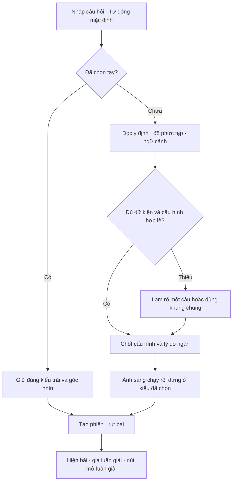

# Tarot: tự chọn kiểu trải theo câu hỏi và nghi thức ánh sáng

> Cập nhật phạm vi triển khai: người dùng chốt “Giữ giao diện hiện tại, thêm tính năng mới”. Các ý tưởng thay giao diện dưới đây là nghiên cứu, không phải thiết kế được triển khai. Tarot giữ nguyên DeckPicker và bàn trải; chỉ thêm Tự động, hiệu ứng sáng và các sửa lỗi tương tác/reflow. Xem kế hoạch và biên bản QA ngày 2026-10-08.

Ngày: 08/10/2026. Trạng thái: nghiên cứu và hướng thiết kế đề xuất, chưa triển khai hoặc kiểm nghiệm chất lượng bộ chọn.

Owner: Codex `/root`. Nhánh: `codex/product-upgrade-research`. Base: `2c02291c6159b63f0fe20793239ba7db73d07a59`. Phạm vi thay đổi chỉ hai tài liệu nghiên cứu trong `docs/design/`. Không gọi AI trả phí, thay giá, sửa mã sản phẩm hoặc deploy.

## 1. Kết luận và yêu cầu đã xác nhận

Có thể thêm chế độ **Tự động** làm mặc định: hệ thống đọc câu hỏi và ngữ cảnh được cung cấp, quyết định kiểu trải cùng góc nhìn phù hợp, rồi trình bày quyết định bằng hiệu ứng sáng chạy lần lượt qua các ô kiểu trải. Người dùng chọn một kiểu cụ thể thì lựa chọn đó được ưu tiên tuyệt đối.

Người dùng đã làm rõ: “Phải tùy vào nội dung câu hỏi, độ phức tạp, ngữ cảnh câu hỏi mà ra quyết định”. Vì vậy random kiểu trải không còn là cơ chế mặc định được đề xuất. Việc rút lá và chiều xuôi/ngược vẫn là quá trình ngẫu nhiên riêng đang có. Chuyển động chỉ diễn đạt lựa chọn, không phải một vòng quay may rủi quyết định độ dài hoặc giá bài đọc.

Thiết kế riêng cho điện thoại, tablet, desktop; kiểm tra bàn phím, zoom, tooltip, dock và lỗi là **bắt buộc**, theo [cổng nghiệm thu toàn sản phẩm](</Users/Thsonjpg/.codex/worktrees/product-upgrade-research/astrox/docs/design/2026-10-08-product-upgrade-research.md>).

## 2. Những gì mã hiện tại đã có

| Quan sát từ source hiện tại | Ý nghĩa đối với nâng cấp |
|---|---|
| Có 5 kiểu trải; riêng 3 lá có 3 khung `ppf`, `sao`, `soa`, tổng cộng 7 cấu hình | Bộ chọn phải quyết định cả kiểu trải lẫn khung, không chỉ số lá |
| Mặc định `three` + `ppf`; câu hỏi tùy chọn | Cần tách chế độ `auto/manual` khỏi kiểu trải đã quyết định; không biến “Tự động” thành tên mới của mặc định 3 lá |
| Rút bài tại client, sau đó người dùng bấm luận giải AI có hiển thị giá | Giữ hai bước nghiệp vụ; chọn kiểu trải không tự mở luận giải trả phí |
| `startDraw` đọc `spread.count` từ render hiện tại | Không gọi `setSpreadId` rồi ngay lập tức dùng closure cũ để rút; truyền cấu hình đã chốt trực tiếp vào thao tác tạo phiên |
| Giá và route suy ra từ `spread.id` và nhãn frame; cache chứa câu hỏi, bộ bài, kiểu trải, nhãn frame và các lá | Cần đưa ID frame ổn định xuyên suốt quyết định → vị trí → prompt → service → lịch sử; giữ đọc cache/lịch sử cũ |
| Nhật ký được ghi khi đã có luận giải hoặc đọc cache; draft rút bài nằm trong state | Không coi nhật ký hiện tại là cơ chế phục hồi mọi phiên đang rút; nếu yêu cầu phục hồi draft phải thiết kế riêng |
| Có reduced motion và cleanup timer | Kế thừa, mở rộng sang bước chọn tự động, yêu cầu hủy request và chặn phản hồi cũ |

Thời gian từ bắt đầu tới lá cuối có `revealed=true`, tính từ các timer hiện tại, là `1050 + (số lá − 1) × 850 + 1350 ms`: 1 lá khoảng 2,4 giây; 3 lá 4,1 giây; 5 lá 5,8 giây; 10 lá 10,05 giây. Đây là phân tích lịch timer, chưa phải đo trên thiết bị thật. Không nên cộng thêm nhiều giây quay lựa chọn trước nguyên nghi thức cũ.

## 3. Ba cách làm và lựa chọn đề xuất

| Cách | Điểm mạnh | Hạn chế | Đánh giá |
|---|---|---|---|
| Random tất cả hoặc random trong nhóm từ khóa | Nhanh, ít chi phí | Không đáp ứng yêu cầu quyết định theo ngữ cảnh; từ khóa dễ hiểu sai phủ định và chủ thể | Không dùng làm cơ chế mặc định |
| Bộ quy tắc ngữ nghĩa giới hạn | Dễ kiểm tra, không phụ thuộc mạng | Bao phủ yếu câu hỏi nhiều ý, tiếng lóng, ẩn dụ và ngữ cảnh tiếp nối | Dùng cho đầu vào trống, fallback và ràng buộc |
| AI phân loại trong danh sách cho phép, sau đó kiểm tra bằng quy tắc | Có khả năng xét mục đích, quan hệ giữa các ý, độ phức tạp và ngữ cảnh | Thêm độ trễ/chi phí vận hành; cần tập đánh giá và xử lý sai | Hướng đề xuất chính |

Theo gợi ý tiếp theo của người dùng, ưu tiên đánh giá **JEV trên B.AI** cho bộ chọn. Chưa chọn model chỉ từ tên hoặc quảng cáo tốc độ. So sánh JEV với một route sinh nội dung hiện có bằng tập câu hỏi, đo chất lượng và p50/p95 độ trễ; chốt cấu hình sau khi có số liệu. Chưa có bằng chứng rằng một model cụ thể chọn đúng cho AstroX.

### 3.1. JEV trên B.AI — ứng viên ưu tiên

Đã xác minh tài liệu B.AI ngày 08/10/2026: có `jev-1.13.0`; JEV tập trung vào quyết định, không viết lời giải tự do. Tiếng Anh là ngôn ngữ huấn luyện chính, nên cần kiểm nghiệm tiếng Việt. Giá niêm yết tham khảo $0,042/triệu token đầu vào, chỉ tính đầu vào; chi phí thực theo hóa đơn. [B.AI JEV](https://docs.b.ai/llmservice/models/jev-1.13.0/).

API dùng `POST /v1/decisions` với `state` và `questions`. Các câu hỏi trong một request độc lập; `confidence` không đồng nghĩa độ chính xác. API không đảm bảo idempotency khi retry. [B.AI Decisions API](https://docs.b.ai/llmservice/api/decisions-api/).

Đề xuất AstroX gửi câu hỏi và ngữ cảnh một lần, yêu cầu các đánh giá độc lập sau; mọi câu đều dựa trực tiếp vào cùng đầu vào:

| Đánh giá đề xuất | Kiểu | Phạm vi và cách dùng |
|---|---|---|
| `spread_fit` | `choice` | 7 cấu hình hiện có cùng `needs_context` và `unsupported_comparison`; mô tả rõ vị trí, đối tượng và điều kiện phù hợp của từng cấu hình |
| `complexity` | `score` | Thang 3 mức: một trọng tâm / nhiều mặt trong một vấn đề / nhiều yếu tố liên kết cần xem sâu; dùng để phát hiện mâu thuẫn, không quy đổi máy móc thành số lá |
| `context_sufficient` | `noul` | Có đủ ngữ cảnh để chọn khung có ích hay không; dùng quyết định làm rõ hoặc fallback |

`spread_fit` phải tự đánh giá độ phức tạp và ý định từ câu hỏi, không tham chiếu kết quả `complexity` chưa tồn tại trong cùng request. Nếu các đánh giá mâu thuẫn, áp dụng chính sách rõ hoặc hỏi một câu; không cộng điểm tùy tiện để cưỡng ép Celtic Cross. Đánh giá xem cả ba trường có cải thiện chất lượng đủ để giữ lại hay chỉ `spread_fit` là đủ.

Ứng dụng chuyển lựa chọn thành `spreadId/frameId` và một câu giải thích VI/EN đã biên tập. Ví dụ `three_sao` → ba vị trí tình huống/hành động/kết quả → “Phù hợp để tìm bước tiếp theo”. Không cần một lần gọi model khác chỉ để viết câu này. Nếu cần biết lý do chi tiết hơn, mở rộng mã lựa chọn/lý do được phép sau khi thử nghiệm, không giả rằng JEV đã sinh lời giải thích.

Giữ ID phiên bản cố định khi benchmark và phát hành. Ngưỡng làm rõ lấy từ tập kiểm chứng, không lấy một con số confidence tùy ý. Ghi riêng tỷ lệ chọn đúng, tỷ lệ từ chối quyết định và độ trễ; không coi schema hợp lệ là quyết định tốt. Kiểm tra tiếng Việt nguyên bản trước; nếu thử dịch trung gian, đo thêm sai lệch nghĩa, độ trễ và chi phí của toàn chuỗi.

**Khoảng trống tích hợp đã xác nhận trong source:** `Provider.protocol` hiện chỉ có `responses | chat | anthropic`; runtime dựng URL tương ứng và chuẩn hóa thành nội dung chat. Chỉ thêm `jev-1.13.0` vào Admin sẽ không tạo được request Decisions đúng. Cần adapter quyết định riêng, dùng hạ tầng quản lý secret/host/timeout hiện có, với validator, telemetry, giới hạn ngân sách và kiểm tra lỗi riêng. Không đưa JEV vào chuỗi fallback viết luận giải hoặc cho nó đi qua bộ kiểm tra bài luận dài.

Phân biệt operation ID phía AstroX để chống bấm trùng với bảo đảm từ provider: timeout có thể đã phát sinh chi phí phía B.AI, nên retry phải có giới hạn. Không tự chuyển sang global fallback sinh bài khi classifier lỗi; chỉ dùng fallback quyết định đã định nghĩa và cùng hợp đồng đầu ra.

Ví dụ ngân sách minh họa: nếu usage thực tế là 1.000 token đầu vào mỗi lượt, 10.000 lượt tương ứng 10 triệu token, khoảng **$0,42** theo đơn giá tham khảo trên, chưa tính retry hoặc bước dịch. Đây là phép tính giả định, không phải báo giá hoặc số đo payload thật; cần đo token của state và toàn bộ tiêu chí trong request.

Chưa gọi endpoint với credential của AstroX hoặc kiểm tra quota của project B.AI; xác minh hiện tại là tài liệu chính thức và source. Bước tiếp theo khi triển khai là smoke test adapter bằng câu hỏi tổng hợp, rồi bộ 80 câu hỏi VI/EN tại mục 9. Chưa thay cấu hình đã lưu, cấu hình published hoặc bất kỳ route production nào.

## 4. Hệ thống cần hiểu điều gì

Đầu vào tối thiểu là câu hỏi hiện tại, ngôn ngữ và phần ngữ cảnh người dùng chủ động đưa vào phiên này. Nếu có “hỏi tiếp”, chỉ dùng phiên trước được người dùng liên kết rõ ràng. Không tự tìm trong toàn bộ lịch sử hoặc suy diễn từ ngày sinh để tăng độ phức tạp.

Quyết định cần xét: người dùng muốn một thông điệp, hiểu diễn biến, tìm hành động, hiểu trở ngại hay xem tương tác giữa hai người; vấn đề có bao nhiêu khía cạnh liên quan; có mốc thời gian và quan hệ nhân quả hay không; chủ thể nào đang được hỏi; có thiếu thông tin quyết định kiểu trải hay không. Số từ chỉ là tín hiệu phụ, không phải thước đo độ phức tạp.

Chọn cấu trúc ít lá nhất vẫn bao phủ đủ các góc nhìn cần thiết. Câu hỏi cảm xúc mạnh không mặc nhiên cần trải dài. Kiểu có giá cao hơn không được cộng ưu tiên. Một câu có chữ “yêu” nhưng hỏi về “công việc tôi yêu thích” không tự động thành trải quan hệ.

| Câu hỏi/ngữ cảnh ví dụ | Cấu hình đề xuất để kiểm nghiệm | Lý do |
|---|---|---|
| “Hôm nay tôi nên chú ý điều gì?” | `one` | Một trọng tâm cho hiện tại |
| “Công việc đã chuyển biến thế nào, hiện tại ra sao, thời gian tới cần lưu ý gì?” | `three/ppf` | Có trục diễn biến theo thời gian |
| “Tôi vừa được giao quản lý nhóm; nên bắt đầu từ đâu?” | `three/sao` | Cần đọc tình huống, hành động và hướng kết quả |
| “Tôi luôn ngại nói ý kiến dù đã chuẩn bị; điều gì đang cản tôi?” | `three/soa` | Trọng tâm bản thân, trở ngại và lời khuyên |
| “Tôi và người yêu liên tục hiểu lầm; hai bên cần thay đổi gì?” | `relationship5` | Hai chủ thể và động lực quan hệ |
| “Việc chuyển nơi làm đang vướng gia đình và nền tảng hiện tại; tôi muốn hiểu thách thức và hướng đi.” | `cross5` | Tình thế có nền tảng, thách thức và định hướng |
| “Tôi vừa chuyển ngành, sắp chuyển nơi ở, gia đình phản đối; muốn xem sâu mục tiêu, tác động bên ngoài và nỗi sợ của mình.” | `celtic10` nếu thật sự cần toàn bộ vị trí | Nhiều yếu tố liên kết và yêu cầu xem sâu |
| Câu dài kể nhiều chi tiết nhưng chỉ hỏi “Thông điệp chính lúc này là gì?” | `one` hoặc 3 lá nếu cần giải thích trở ngại | Ý định cuối quan trọng hơn độ dài |
| “Tôi có nên tiếp tục không?” nhưng không có ngữ cảnh | Một câu làm rõ ngắn, có thể bỏ qua | Chưa biết tiếp tục việc gì; không tự đoán tình yêu |
| Không nhập câu hỏi | `one`, nhãn “Thông điệp chung” | Không có cơ sở gọi là lựa chọn cá nhân hóa |

Các hàng là giả thuyết thiết kế để xây tập đánh giá, không phải luật cứng đã được xác thực. Các khung 3 lá dựa trên quan hệ giữa các vị trí; [tài liệu của Labyrinthos](https://labyrinthos.co/blogs/learn-tarot-with-labyrinthos-academy/3-card-tarot-spreads-simple-tarot-spreads-organized-by-layout) minh họa các cách tổ chức như thời gian hoặc tình huống–hành động–kết quả. Nguồn này giúp thiết kế khung đọc, không chứng minh khả năng dự đoán hoặc độ chính xác của AI chọn trải.

Khoảng trống cần giữ rõ: hiện chưa có khung đối chiếu lựa chọn A/B chuyên biệt. Với “chọn A hay B”, không được âm thầm đổi nhãn của một khung đang có rồi gửi sai service. Bản đầu có thể hỏi trọng tâm cần cân nhắc và dùng khung lời khuyên; nếu cần so sánh đối xứng, bổ sung khung riêng trong đợt kế tiếp cùng registry, giá, prompt, lịch sử và kiểm chứng chất lượng. Không hứa rằng mọi câu hỏi đều có khung lý tưởng trong 7 cấu hình hiện tại.

## 5. Luồng trải nghiệm đề xuất

Màn đầu ưu tiên “Bạn muốn hỏi điều gì?”, chế độ **Tự động**, bộ bài thu gọn và nút **Trải bài**. Tự động được chọn sẵn, không phải một bước người dùng phải bật. Người dùng vẫn nhìn thấy lối **Tự chọn**; khi mở có sơ đồ nhỏ và tên của 5 kiểu, khung 3 lá xuất hiện khi chọn 3 lá.

Sau khi bấm, hiển thị “Đang chọn kiểu trải…”. Kết quả chỉ cần tên và một lý do: **“3 lá · Tình huống – Hành động – Kết quả”**, “Phù hợp để tìm bước tiếp theo.” Lý do lấy từ mã lý do đã kiểm soát và bản dịch, không cần hiển thị một đoạn suy luận của AI.

Nếu thật sự thiếu dữ kiện, hỏi tối đa một câu ngắn ngay trong form, ví dụ “Bạn đang hỏi về công việc hay một mối quan hệ?”. Có thể bỏ qua để dùng khung chung 3 lá `soa`; ghi rõ “Khung tổng quát” và cho đổi tay. Không bắt đầu một cuộc phỏng vấn dài trước mỗi lượt. Đầu vào trống dùng một lá trực tiếp, không cần gọi AI phân loại.

Nếu phân loại lỗi/timeout: giữ câu hỏi, nêu “Chưa chọn được theo câu hỏi” và cung cấp **Dùng 3 lá** / **Tự chọn**; chỉ bắt đầu theo fallback khi người dùng bấm. Không quay rồi tuyên bố đã hiểu câu hỏi khi thực tế backend lỗi. Đây là đường phục hồi ngoại lệ, không thêm bước vào lượt bình thường.

Chọn tay bỏ qua bước phân loại và hiệu ứng chọn kiểu. Quay về sửa cùng draft giữ lựa chọn tay; tạo lượt mới trở về Tự động. Thay đổi câu hỏi trước khi rút làm mất hiệu lực quyết định cũ. Trong khi đang chọn, có **Hủy** để trở lại form; phản hồi đến trễ không được ghi đè draft hoặc lựa chọn tay mới.

## 6. Hiệu ứng quay sáng

Đề xuất một dải hoặc cụm 5 sơ đồ kiểu trải. Viền sáng vàng ấm đi qua từng ô theo đường liên tục, nhịp đầu nhanh hơn rồi chậm lại, dừng và giữ viền ở kiểu được chọn. Chỉ ánh sáng di chuyển, tên và sơ đồ đứng yên để dễ đọc. Không dùng bánh xe lớn chiếm màn hình; giữ nhận diện kem–xanh hiện có.

Trong lúc chờ AI, dùng chuyển động nhẹ trong vùng lựa chọn. Khi đã có quyết định hợp lệ, vòng sáng kết thúc ở đúng ô; không cho animation tự tạo kết quả. Với một kiểu được xác định rõ, có thể rút vòng chạy còn một nhịp sáng. Mục tiêu thử nghiệm cho đoạn giới thiệu lựa chọn là khoảng 1,6–2,2 giây, bao gồm phần chờ có thể chồng lấp; không ép chờ đủ thời lượng nếu người dùng bỏ qua. Đây là thông số thiết kế ban đầu, chưa phải số đo UX.

Nếu AI chậm, dừng nhịp quay dồn dập và giữ trạng thái chờ tĩnh; không lặp vô hạn hoặc bịa tiến độ. Đề xuất thử ngân sách chờ phân loại tối đa 4 giây trước đường phục hồi, rồi hiệu chỉnh theo đo p95. **Bỏ qua hiệu ứng** chỉ bỏ chuyển động; khi quyết định chưa có, vẫn chờ dữ liệu hoặc dùng đường phục hồi, không tự chọn khác để kết thúc animation.

Tối ưu cả nghi thức: tránh nối 2 giây quay + 1 giây xáo + 9 giây lật. Với nhiều lá, cho xuất hiện theo nhóm và có **Hiện tất cả**. Mốc thử cho phần animation sau khi có quyết định là không quá khoảng 5 giây tới đầy đủ lá ở chế độ thường; reduced motion và bỏ qua hiển thị ngay trạng thái cuối sẵn có. Cần đo trên máy yếu, không chỉ desktop.

Kết quả chọn kiểu, danh sách lá và chiều xuôi/ngược được chốt một lần trong phiên. Bỏ qua, đổi viewport, xoay máy hoặc quay lại tab không đổi kết quả. Không tự phát âm thanh. Chỉ thông báo kết quả cuối qua live region, không đọc tên mọi ô được ánh sáng lướt qua, không di chuyển keyboard focus theo ánh sáng.

Tôn trọng cả tùy chọn giảm chuyển động hệ thống và AstroX: bỏ chạy vòng, xáo/flip 3D; hiện viền chọn tĩnh. Đây là lựa chọn sản phẩm phù hợp hướng dẫn về việc tắt chuyển động không thiết yếu của [W3C, SC 2.3.3 mức AAA](https://www.w3.org/WAI/WCAG22/Understanding/animation-from-interactions.html), không phải tuyên bố đã đạt toàn bộ WCAG AAA.

Ánh sáng phải chuyển mềm, không tạo chớp tương phản mạnh, chớp đỏ hoặc đổi sáng toàn màn hình. Kiểm tra bản animation thực tế theo [W3C về ngưỡng nháy sáng](https://www.w3.org/WAI/WCAG22/Understanding/three-flashes-or-below-threshold.html); chỉ có nút tắt không thay thế việc thiết kế hiệu ứng an toàn ngay từ đầu.

## 7. Bố cục riêng theo thiết bị — bắt buộc

| Bề mặt | Setup/chọn kiểu | Trải bài/đọc | Bàn phím, dock và tooltip |
|---|---|---|---|
| Điện thoại | Câu hỏi trước; Auto một hàng; chọn tay mở cụm 2 cột, ô cuối chiếm hàng; bộ bài dạng lựa chọn gọn | Lá được chọn và ý chính gần nhau; trải lớn có sơ đồ tổng quan + đọc theo vị trí; chi tiết ở panel trong dòng | Bàn phím mở thì CTA ở form, dock tạm ẩn; tooltip bằng chạm chuyển thành chú giải có nút đóng; safe area đầy đủ |
| Tablet | Hai vùng khi đủ chiều rộng: câu hỏi/lựa chọn bên trái, preview bên phải; ở split view hẹp chuyển một cột | Sơ đồ và chi tiết đặt cạnh; cảm ứng vẫn là thao tác hạng nhất; chế độ ngang không thu nhỏ mọi lá để nhét | Không dựa vào hover; kiểm tra bàn phím rời lẫn bàn phím ảo; giữ vị trí đang đọc khi xoay |
| Desktop | Form có độ rộng đọc giới hạn, preview rộng hơn; 5 lựa chọn thành dải khi đủ chỗ | Sơ đồ chính + cột giải nghĩa theo lá; mục lục khi bài dài; không kéo giãn chữ theo màn hình | Tab/focus rõ; tooltip mở cả hover và focus, Escape đóng; zoom lớn chuyển bố cục phù hợp |

Giữ đúng danh tính và thứ tự vị trí của trải bài trên mọi thiết bị. Nếu Celtic Cross không đủ chỗ, dùng sơ đồ overview có thể phóng to cùng danh sách vị trí tương đương; không đảo vai trò lá vì đổi grid. Các mốc 320px, 200%/400% zoom và ma trận 30 viewport theo tài liệu tổng thể. Tiêu chí là hoàn tất tác vụ, không chỉ ảnh chụp không tràn ngang.

## 8. Ranh giới kỹ thuật cần giữ khi triển khai sau

Bộ phân loại nên chạy phía server qua lớp provider được quản lý. Đầu vào giới hạn độ dài, chỉ gửi khi bấm Trải bài, không gửi mỗi lần gõ. Thông tin câu hỏi là dữ liệu, không được thực thi các chỉ dẫn trong câu hỏi nhằm đổi giá, model hoặc route. Không ghi câu hỏi nguyên văn vào analytics mặc định.

Đầu ra có cấu trúc giới hạn: trạng thái `selected/needs_clarification`, `spreadId`, `frameId` khi cần, `reasonCode`, phiên bản chính sách chọn. Server kiểm tra allowlist, tổ hợp ID hợp lệ, dịch vụ đang xuất bản/khả dụng theo thị trường. AI không tạo kiểu trải, số lá, giá hoặc ID dịch vụ tùy ý. Không hiển thị phần trăm “phù hợp” chưa được hiệu chuẩn.

Chế độ `auto/manual`, câu hỏi snapshot, locale/market, bộ bài, cấu hình đã chốt, nguồn quyết định và operation ID thuộc phiên. Tách trạng thái `setup → resolving → selecting → drawing → revealed`; clarification/error/cancel có nhánh rõ. Request bị hủy, tài khoản đổi hoặc draft sửa thì kết quả cũ vô hiệu. Double click không tạo hai phiên; retry luận giải giữ nguyên các lá và cấu hình.

Không gọi endpoint luận giải trả phí hiện tại chỉ để phân loại câu hỏi. Nếu chọn tự động là tiện ích mặc định miễn phí cho người dùng, chi phí AI phân loại do sản phẩm chịu và phải có rate limit, cache trong phạm vi phiên, ngân sách vận hành. Đây là đề xuất chính sách cần định nghĩa khi triển khai, không khẳng định backend hiện có endpoint miễn phí tương ứng.

Sau khi kiểu trải được chốt, lấy báo giá từ server cho đúng service và thị trường, hiển thị trước khi người dùng bấm luận giải. Nếu giá/dịch vụ thay đổi phải báo lại; không tự đổi trải đã rút. Nhớ phân biệt giá hiển thị với việc đã thực hiện giao dịch. Chọn nhiều lá không được tự tạo giao dịch.

Nên truyền `frameId` rõ ràng thay cho việc suy ra ID từ nhãn hiển thị. Metadata quyết định bổ sung không làm thay đổi danh tính của bài đã mua; bài cũ thiếu trường vẫn đọc được. Draft phục hồi cần riêng biệt với nhật ký đã có luận giải, có phạm vi tài khoản/locale, hạn lưu và thao tác xóa phù hợp.

Các thay đổi shared backend, registry, pricing, navigation phải qua một owner tích hợp theo hợp đồng dự án. Nghiên cứu này không cấp phép đổi contract/giá hoặc tạo service mới âm thầm.

## 9. Bộ kiểm chứng trước khi nghiệm thu

Chất lượng chọn trải phải đánh giá trước khi chốt model. Đề xuất ít nhất 80 câu hỏi VI/EN, được con người gán một hoặc nhiều cấu hình chấp nhận được, lý do và trường hợp cần làm rõ; bao phủ đơn giản/phức tạp, phủ định, nhiều ý, câu ngắn thiếu ngữ cảnh, câu dài đơn giản, lỗi chính tả và câu tiếp nối. Tách tập dùng chỉnh prompt khỏi tập đánh giá cuối; chạy lặp một phần để đo độ ổn định. Không công bố độ chính xác trước khi có dữ liệu.

Mốc nghiệm thu chất lượng ban đầu đề xuất: ít nhất 90% thuộc tập lựa chọn được đánh giá chấp nhận; không cấu hình sai/không khả dụng lọt ra UI sau validation; không tăng số lá do câu dài đơn thuần trong tập phản ví dụ. Đây là mục tiêu cần thống nhất và kiểm nghiệm, không phải kết quả hiện có. Người đánh giá cần xét khung có đủ vị trí trả lời câu hỏi, tránh chỉ đồng ý với câu giải thích nghe hợp lý.

| Nhóm | Bằng chứng bắt buộc |
|---|---|
| Quyết định | Chọn theo ý định/ngữ cảnh; phân biệt `ppf/sao/soa`; có lý do ngắn đúng; không tự chuyển sang 10 lá vì độ dài hoặc giá |
| Chọn tay | Luôn thắng auto; frame đã chọn được giữ; request cũ không ghi đè; không gọi classifier khi không cần |
| Đầu vào khó | Trống, mơ hồ, nhiều chủ đề, A/B, VI/EN, phủ định, câu hỏi chứa chỉ dẫn nhằm phá bộ chọn có hành vi xác định |
| Sự cố classifier | Offline, timeout, lỗi schema, ID lạ, dịch vụ khóa, phản hồi đến muộn có đường phục hồi; không giả thành công |
| Phiên | Double click, back, đổi tab, resize, xoay máy, hủy, skip, reload theo phạm vi draft đã thiết kế không tạo lượt/bài khác ngoài ý muốn |
| Giá/dữ liệu | Spread + frame + vị trí + prompt + service + giá + lịch sử khớp; bài cũ đọc được; chọn tự động không thu tiền |
| Motion | Vòng sáng dừng đúng kiểu, không chớp mạnh; skip và reduced motion giữ cùng kết quả; tổng thời gian đo trên thiết bị yếu |
| Thiết bị | Mobile/tablet/desktop có bố cục riêng; keyboard thật/ảo, zoom, tooltip mép màn hình, dock/safe area, dọc/ngang và lỗi đều đạt |
| Theo dõi | Đo độ trễ chọn, tỷ lệ fallback/làm rõ/đổi tay/bỏ dở và thời gian tới đủ lá; không dùng tỷ lệ mua trải đắt làm mục tiêu của bộ chọn |

Chưa thực hiện bộ đánh giá AI, prototype motion, benchmark, kiểm thử tài khoản hoặc thiết bị thật trong lượt nghiên cứu này. Mã hiện tại và tài liệu bên ngoài chỉ xác nhận nền tảng khả thi và các ràng buộc thiết kế, chưa chứng minh trải nghiệm mới đạt yêu cầu.

## 10. Điểm nối mã nguồn đã kiểm tra

- [Định nghĩa 5 kiểu và 3 khung](/Users/Thsonjpg/.codex/worktrees/product-upgrade-research/astrox/web/src/lib/tarot.ts:93).
- [Mặc định và trạng thái phiên](/Users/Thsonjpg/.codex/worktrees/product-upgrade-research/astrox/web/src/components/tarot/TarotClient.tsx:55).
- [Tạo pool và timer nghi thức](/Users/Thsonjpg/.codex/worktrees/product-upgrade-research/astrox/web/src/components/tarot/TarotClient.tsx:134).
- [Chọn tay và frame hiện tại](/Users/Thsonjpg/.codex/worktrees/product-upgrade-research/astrox/web/src/components/tarot/TarotClient.tsx:203).
- [Truyền cấu hình sang luận giải](/Users/Thsonjpg/.codex/worktrees/product-upgrade-research/astrox/web/src/components/tarot/TarotClient.tsx:512).
- [Service, báo giá và cache](/Users/Thsonjpg/.codex/worktrees/product-upgrade-research/astrox/web/src/components/tarot/InterpretationPanel.tsx:60).
- [Nút luận giải trả phí](/Users/Thsonjpg/.codex/worktrees/product-upgrade-research/astrox/web/src/components/tarot/InterpretationPanel.tsx:209).
- [Cấu trúc nhật ký](/Users/Thsonjpg/.codex/worktrees/product-upgrade-research/astrox/web/src/lib/tarot-history.ts:22).
- [Protocol provider hiện có](/Users/Thsonjpg/.codex/worktrees/product-upgrade-research/astrox/services/admin/config.ts:14).
- [Ghép endpoint provider hiện có](/Users/Thsonjpg/.codex/worktrees/product-upgrade-research/astrox/services/admin/runtime.mjs:53).
